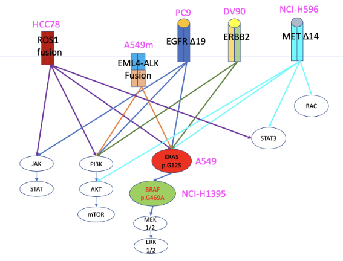

{{ page.group }}

# Identifying the most appropriate and performant analysis tools

A plethora of SCO tools exist, and yet standards on how to benchmark or evaluate the accuracy of each tool are lacking. Furthermore, most benchmark efforts are focused on certain cell types or tissues.

- The first goal is the identification of a few scRNA-seq datasets for developing the rules to be used for defining datasets suitable to become benchmarking cases. We aim to create a central pipeline to benchmark SCO tools and define standard datasets for such benchmarks. The outcomes of benchmarking and software challenges allow data scientists to make an informed decision on the software to be used in their analytical workflows.
- To facilitate findability and usability, we aim to contribute to tool registries and provide portable software environments of the most commonly used tools/workflows.
- In the long term, we aim to provide cloud deployable analysis pipelines that utilise Galaxy and Chipster platforms, as well as providing curated datasets for user driven benchmark on the OpenEBench infrastructure.

## Benchmark experiments

Researchers in computational biology and other scientific fields often encounter the challenge of selecting the most appropriate computational methods to analyze their data. To determine the strengths of each method or to make recommendations on the best options for an analysis, benchmarking studies are conducted, which rigorously compare the performance of different methods using well-characterized benchmark datasets. However, to ensure that the results are reliable, unbiased, and informative, benchmarking studies must be carefully designed and executed. [*Weber et al. (2019)*](https://pubmed.ncbi.nlm.nih.gov/31221194/) provided a set of practical guidelines and recommendations for conducting benchmarking analyses of high quality. 

As single-cell technologies continue to advance, an increasing number of analysis tools are becoming available to researchers. Consequently, there is a growing need for datasets and methods that support systematic benchmarking and evaluation of these tools.  Validating and benchmarking analysis tools for single-cell measurements is part of the "Eleven grand challenges in single-cell data science" [[*Lähnemann et al. (2020)*](https://pubmed.ncbi.nlm.nih.gov/32033589/)].

Benchmarking can be approached at two different level:

- In silico
- wet lab experiment

### In silico benchmark experiments
The validation and comparison of tools in the field of simulation is an intriguing area. Despite the fact that simulators have several limitations, there has been a significant effort in the past few years to enhance their power, as noted by [*Cao et al. (2021)*](https://pubmed.ncbi.nlm.nih.gov/34824223/). The scDesign3, a newly published simulator by [*Song et al. (2023)*](https://pubmed.ncbi.nlm.nih.gov/37169966/), appears to be a versatile tool that is capable of overcoming some of the limitations of other existing simulators, according to the developers.

### Wet lab experiment

Over the past few years, there has been a significant increase in the number of published single-cell omics studies, which serve as valuable resources for benchmark experiments. In particular, [*Svensson et al. (2020)*](https://www.ncbi.nlm.nih.gov/pmc/articles/PMC7698659/) have compiled a comprehensive collection of single-cell omics datasets with manually curated metadata. As part of the implementation study of the single-cell omics community, we are creating a series of datasets specifically designed for benchmarking computational tools that focus on single-cell tumor heterogeneity.

#### Benchmark experiments addressing tumor heterogeneity

[*Tumor heterogeneity*](https://www.cancer.gov/publications/dictionaries/cancer-terms/def/tumor-heterogeneity), where distinct cancer cells exhibit diverse morphological and phenotypic profiles, including gene expression, metabolism, and proliferation, poses challenges for molecular prognostic markers and patient classification for targeted therapies. Various omics technologies, such as bulk [[*Babu & Snyder (2023)*](https://pubmed.ncbi.nlm.nih.gov/37119971/)] and single-cell omics [[*Flynn et al. (2023)*](https://pubmed.ncbi.nlm.nih.gov/37159875/)] approaches, have enabled the characterization of diverse molecular layers at an unprecedented scale and resolution, offering a comprehensive perspective on the behavior of tumors. The integration of multiple omics datasets enables systematic exploration of diverse molecular information [[*Yue et al. (2023)*](https://pubmed.ncbi.nlm.nih.gov/36723121/)] at each biological layer, but also presents challenges in extracting meaningful insights from the exponentially growing volume of multi-omics data. To address this challenge, efficient algorithms are required to dig into the data and reveal the underlying complexities of cancer's intricate biological processes. The past few years have seen a proliferation of new computational methods for analyzing single-cell omics data, which can make it challenging to select the most appropriate tool for a particular task.  As a result, it is crucial to establish benchmarking platforms [[*Mangul et al. (2019)*](https://www.nature.com/articles/s41467-019-09406-4), [*Decamps et al. (2021)*](https://bmcbioinformatics.biomedcentral.com/articles/10.1186/s12859-021-04381-4), [OpenEBench](https://openebench.bsc.es/), [Omnibenchmark](https://omnibenchmark.pages.uzh.ch/omb-site/), [*Knight et al. (2023)*](https://pubmed.ncbi.nlm.nih.gov/36847692/)] and datasets [[*Tian et al. (2018)*](https://www.refine.bio/experiments/SRP155039/designing-a-single-cell-rna-sequencing-benchmark-dataset-to-compare-protocols-and-analysis-methods-rnamix-sort-seq), [Refine.bio](https://www.refine.bio/)] in order to create a controlled environment for the validation of bioinformatics tools in the field of single-cell omics analysis.

##### Tian et al. (2019) dataset
As part of [*their article*](https://pubmed.ncbi.nlm.nih.gov/31133762/) they created ‘pseudo cells’ from up to five distinct human lung adenocarcinoma cell lines. GEO dataset [GSM3618014](https://www.ncbi.nlm.nih.gov/geo/query/acc.cgi?acc=GSM3618014) contains the mixture of five cell lines: 

- H2228 (PTPN3 KO [[*Jung et al (2012)*](https://pubmed.ncbi.nlm.nih.gov/22334442/)])
- H1975 (EGFR L858R and T790M mutations [[*Zhao et al. 2015*](https://pubmed.ncbi.nlm.nih.gov/25483995/)])
- A549 (KRAS p.G12S, growth and proliferation,  PMID: [*Yoon et al. (2010)*](https://pubmed.ncbi.nlm.nih.gov/20358631/)
- H838
- HCC827 (EGFR L858R mutation [[*Juchum et al. (2015)*](https://www.sciencedirect.com/topics/medicine-and-dentistry/hcc827-cell-line)])

Data were generated using 10XGenomics v2 chemistry.

##### SCONE datasets
As part of the Single Cell Community implementation study we are focusing in providing a set of benchmark experiments to address the extraction of biological knowledge from "controlled" cancer heterogeneity.

###### BE1

We are performing a 10XGenomics scRNAseq experiment including the following elements:

-  PC9 (EGFR Del19, activating mutation, PMID: [*Simonetti et al. (2010)*](https://pubmed.ncbi.nlm.nih.gov/21167064/) 
-  A549 (KRAS p.G12S, growth and proliferation,  PMID: [*Yoon et al. (2010)*](https://pubmed.ncbi.nlm.nih.gov/20358631/) 
-  NCI-H596 (MET Del14 , enhanced protection from apoptosis and cellular migration PMID: [*Cerqua et al. (2022)*](https://pubmed.ncbi.nlm.nih.gov/35636967/) 
-  NCI-H1395 (BRAF p.G469A, gain of function, resistant to all tested MEK +/− BRAF inhibitors, PMID: [*Negrao et al. (2020)*](https://pubmed.ncbi.nlm.nih.gov/32540409/)) 
-  DV90 (ERBB2 p.V842I, increases kinase activity, PMID: [*Boese et al. (2013)*](https://pubmed.ncbi.nlm.nih.gov/23220880/) 
-  HCC78 (SLC34A2-ROS1 Fusion, ROS1 inhibitors have antiproliferative effect PMID: [*Davies et al. (2012)*](https://pubmed.ncbi.nlm.nih.gov/22919003/) 
-  [*EML4-ALK Fusion-A549 Isogenic Cell*](https://www.nature.com/articles/d42473-019-00011-z) 
-  White cells from donor buffy coat (PBMC)

The above figure described the driver genes assocaited to each cell line.

PBMC will be isolated from healthy donor and snap frozen. Before single cell generation, PBMC will be marked with Biolegend TotalSeq™-B human universal cocktail v1.0. 
10XGenomics analysis will be performed using CellPlex 10XGenomics technology, allowing samples labelling.
  
The experiment will be done using CellPlex technology from 10XGenomics allowing multiplexing samples into a single channel and therefore removing unwanted batch effects.

Immunological cell types from PBMC will be annotated thanks to the help of an experienced immunologist. 
  
The count tables from the entire BE1 experiment will be made available through an R Shiny app, allowing users to construct datasets encompassing different cell lines at varying ratios.
  
**Actual state of the project:** collected and grown five of the seven cell lines. 

**Expected data availability:** September 2023
  
For further information please contact **raffaele dot calogero at unito dot it**

###### BE2

The cell lines from for BE1 will be used to generate surrogate tumor-tissues for spatial transcriptomics, by embedding in matrigel pools of the 7 cell lines at different ratios. For each cell ratio we will generate a slide (2 sections) using Visium for FFPE samples and  six slides using [*Curio Bioscience*](https://curiobioscience.com/product/) spatial platform for OTC fresh frozen samples. 
In total we expect produce three cell lines ratios:
  
- Cell line 1 40%, cell line 2 25% cell line 3 20%, cell line 4 5%, PBMC 10%
- Cell line 1 45% cell line 2 25%, cell line 3 10%, cell line 4 10%, cell line 5 5%, PBMC 5%
- Cell line 1 25%, cell line 2 25% cell line 3 10% cell line 4 10%, cell line 4 10%, cell line 5 5%, cell line 6 5%, cell line 7 5%, PBMC 5%.
  
**Actual state of the project:** Expecting results from BE1. 

**Expected data availability:** December 2023

###### BE3

The cell lines for BE1 will be used to generate combined scRNAseq and scATACseq experiment using [*10X genomics technology for multi-omics*](https://www.10xgenomics.com/products/single-cell-multiome-atac-plus-gene-expression).

**Actual state of the project:** Expecting results from BE1. 

**Expected data availability:** July 2024

 
