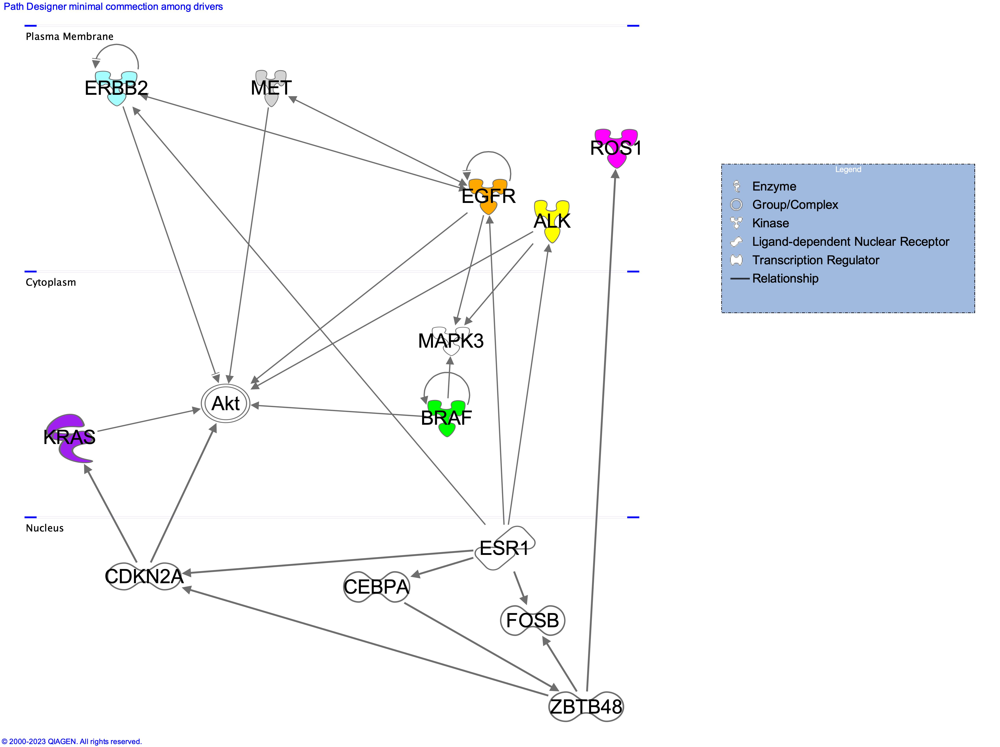
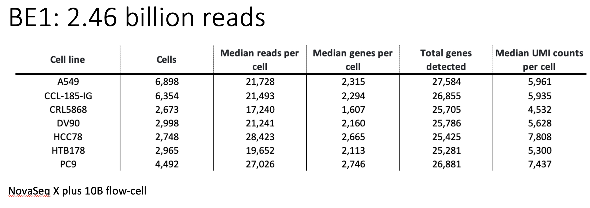
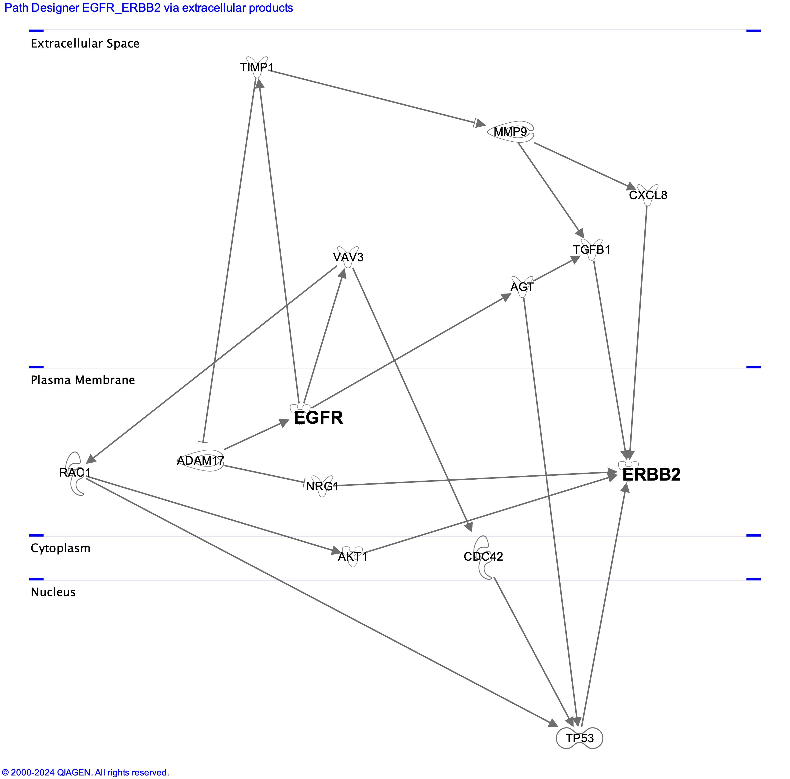

{{ page.group }}

# Benchmarking analysis tools for single-cell and spatial omics data

As single-cell and spatial technologies continue to advance, an increasing number of analysis tools become available to researchers. Consequently, there is a growing need for datasets and methods that support systematic benchmarking and evaluation of these tools. Validating and benchmarking analysis tools for single-cell measurements has been listed as one of the "Eleven grand challenges in single-cell data science" by [*Lähnemann et al. (2020)*](https://pubmed.ncbi.nlm.nih.gov/32033589/).

The [*ELIXIR Single-Cell Omics Community*](https://elixir-europe.org/communities/single-cell-omics) facilitates benchmarks, sets standards of evaluation, and engages with the community to benchmark particular tasks. For example, we organized [*SpaceHack 2.0*](https://www.denbi.de/de-nbi-events/1608-spacehack-2-0) which included the following focus areas, among others:
-  investigating evaluation metric (e.g. ARI, NMI) with a focus on novel metrics and qualitative interpretation
-  community benchmarking via Omnibenchmark
-  reference datasets across technologies (e.g. Visum, Xenium, Slide-seq, MERFISH) and tissues (e.g. DLPFC, hippocampus, olfactory bulb, liver)

This page provides a brief introduction to benchmarking infrastructures and datasets.

<!--
It is crucial to establish benchmarking platforms [[*Mangul et al. (2019)*](https://www.nature.com/articles/s41467-019-09406-4), [*Decamps et al. (2021)*](https://bmcbioinformatics.biomedcentral.com/articles/10.1186/s12859-021-04381-4), [OpenEBench](https://openebench.bsc.es/), [Omnibenchmark](https://omnibenchmark.pages.uzh.ch/omb-site/), [*Knight et al. (2023)*](https://pubmed.ncbi.nlm.nih.gov/36847692/)] and datasets [[*Tian et al. (2018)*](https://www.refine.bio/experiments/SRP155039/designing-a-single-cell-rna-sequencing-benchmark-dataset-to-compare-protocols-and-analysis-methods-rnamix-sort-seq), [Refine.bio](https://www.refine.bio/)] in order to create a controlled environment for the validation of bioinformatics tools in the field of single-cell omics analysis.
-->

## Benchmarking infrastructures

### [*Omnibenchmark*](https://omnibenchmark.org/)
Omnibenchmark provides community-driven, extensible and continuously-updating benchmarks. Omnibenchmark defines, runs and versions benchmark execution pipelines by leveraging a formal benchmark specification and a set of (reusable) benchmarking modules. Each benchmarking module implements a data processing step (typically a preprocessing step, method, or metric) and is stored as an independent git repository. Anyone can start (or contribute to) a benchmark. A contribution can be a relevant ground truth dataset, a missing method or metric, or update to existing modules. Omnibenchmark relies on widely used, free and open software solutions, including: git (version control system), GitLab (DevOps), Snakemake (workflow management system), easybuild (reproducible software environments), and apptainer (containerization), among others.

### [*openEBench*](https://openebench.bsc.es/)
OpenEBench is the ELIXIR benchmarking and technical monitoring platform for bioinformatics tools, web servers and workflows.

### [*DANCE*](https://genomebiology.biomedcentral.com/articles/10.1186/s13059-024-03211-z)
DANCE is the first standard, generic, and extensible benchmark platform for accessing and evaluating computational methods across the spectrum of benchmark datasets for numerous single-cell analysis tasks. Currently, DANCE supports 3 modules and 8 popular tasks with 32 state-of-art methods on 21 benchmark datasets. People can easily reproduce the results of supported algorithms across major benchmark datasets via minimal efforts, such as using only one command line. In addition, DANCE provides an ecosystem of deep learning architectures and tools for researchers to facilitate their own model development. DANCE is an open-source Python package that welcomes all kinds of contributions. [*OmicsML/dance GitHub*](https://github.com/OmicsML/dance?tab=readme-ov-file).

### [*IBRAP*](https://academic.oup.com/bib/article/24/2/bbad061/7058851)
Integrated Benchmarking scRNA-seq Analytical Pipeline (IBRAP) contains a suite of analytical components that can be interchanged throughout the pipeline alongside multiple benchmarking metrics that enable users to compare results and determine the optimal pipeline combinations for their data.

## Benchmarking datasets

Benchmarking data can be created in wet lab or in silico by simulators. In this section we present some wet lab experiments and introduce some simulators.

### Simulators for creating benchmarking data
Despite the fact that simulators have several limitations, there has been a significant effort in the past few years to enhance their power, as noted by [*Cao et al. (2021)*](https://pubmed.ncbi.nlm.nih.gov/34824223/). The scDesign3 [*Song et al. (2024)*](https://pubmed.ncbi.nlm.nih.gov/37169966/) is a versatile tool simulating single cell and spatial transcriptomics data. [*GRouNdGAN*](https://emad-combine-lab.github.io/GRouNdGAN/), GRN-guided in silico simulation of single-cell RNA-seq data using causal generative adversarial networks, is a causal implicit generative model for reference-based GRN-guided simulation of scRNA-seq [[*Zinati et al. 2024*](https://www.nature.com/articles/s41467-024-48516-6)]. scReadSim is a single-cell RNA-seq and ATAC-seq read simulator [Yan et al. 2023](https://pubmed.ncbi.nlm.nih.gov/37980428/)

### Wet lab experiments

Over the past few years, there has been a significant increase in the number of published single-cell omics studies, which serve as valuable resources for benchmark experiments. In particular, [*Svensson et al. (2020)*](https://www.ncbi.nlm.nih.gov/pmc/articles/PMC7698659/) have compiled a comprehensive collection of single-cell omics datasets with manually curated metadata. As part of the Implementation study SCONE of the ELIXIR Single-Cell Omics Community, we created a series of datasets specifically designed for benchmarking computational tools that focus on single-cell tumor heterogeneity.

#### HubMAP consortium
[*HubMAP*](https://hubmapconsortium.org/) created an open, global atlas of the human body at the cellular level. The focus of HuBMAP is understanding the intrinsic intra-, inter-, and extra- cellular biomolecular distribution in human tissue. HuBMAP will focus on fresh, fixed, or frozen healthy human tissue using in situ and dissociative techniques that have high-spatial resolution.

#### Benchmark experiments addressing tumor heterogeneity

Distinct cancer cells exhibit diverse morphological and phenotypic profiles, including gene expression, metabolism, and proliferation. This [*tumor heterogeneity*](https://www.cancer.gov/publications/dictionaries/cancer-terms/def/tumor-heterogeneity) poses challenges for molecular prognostic markers and patient classification for targeted therapies. Various omics technologies, such as bulk [[*Babu & Snyder (2023)*](https://pubmed.ncbi.nlm.nih.gov/37119971/)] and single-cell omics [[*Flynn et al. (2023)*](https://pubmed.ncbi.nlm.nih.gov/37159875/)] approaches, have enabled the characterization of diverse molecular layers at an unprecedented scale and resolution, offering a comprehensive perspective on the behavior of tumors. The integration of multiple omics datasets enables systematic exploration of diverse molecular information [[*Yue et al. (2023)*](https://pubmed.ncbi.nlm.nih.gov/36723121/)] at each biological layer, but also presents challenges in extracting meaningful insights from the exponentially growing volume of multi-omics data. To address this challenge, efficient algorithms are required to dig into the data and reveal the underlying complexities of cancer's intricate biological processes. 

##### Healthy and disease single-cell datasets

[*CELLxGENE*](https://cellxgene.cziscience.com/datasets) is a suite of tools that help scientists to find, download, explore, analyze, annotate, and publish single-cell datasets. It allows users to download a wide set of published single-cell experiments as h5 or seurat (v3) format. 

[*CellCommuNet*](http://www.inbirg.com/cellcommunet/) is an atlas of cell–cell communication networks from single-cell RNA sequencing data of human and mouse tissues in normal and disease states [[*Ma et al. NAR 2024*](https://academic.oup.com/nar/article/52/D1/D597/7321072)].

[*IMMUcan scDB*](https://immucanscdb.vital-it.ch/) is a fully integrated scRNA-seq database exclusively dedicated to human cancer. IMMUcan scDB encompasses 144 datasets on 56 different cancer types, annotated in 50 fields containing precise clinical, technological, and biological information [[Camps et al. Cancer Res. 2023](https://pubmed.ncbi.nlm.nih.gov/36459564/)].

[*TISCH2*](http://tisch.comp-genomics.org/) is s a scRNA-seq database focusing on tumor microenvironment (TME). TISCH2 provides detailed cell-type annotation at the single-cell level, enabling the exploration of TME across different cancer types.

[*DISCO*](https://www.immunesinglecell.org/) stores a manually curated selection of publicly available datasets, comprising more than 9000 samples, within the repository. These samples are pre-processed by re-aligning to a single reference genome and undergo a rigorous cell level quality control (QC) pipeline, which filters out samples based on mitochondrial mRNA counts, unique feature counts, and cell numbers using an automated algorithm. It also provides manual metadata curation, harmonizing the metadata across datasets.

[*PanglaoDB*](https://panglaodb.se/) is a database for the scientific community interested in exploration of single cell RNA sequencing experiments from mouse and human. It integrates data from multiple studies and present them through a unified framework.

[*SPICA*](https://spica.unil.ch/) is the Swiss Portal for Immune Cell Analysis.

[*Broad Single Cell Portal*](https://singlecell.broadinstitute.org/single_cell) Broad institute single cell portal.

##### Lung adenocarcinoma cell line mixture 
‘Pseudo cells’ were created from to five distinct human lung adenocarcinoma cell lines by [*Tian et al 2019*](https://pubmed.ncbi.nlm.nih.gov/31133762/). GEO dataset [GSM3618014](https://www.ncbi.nlm.nih.gov/geo/query/acc.cgi?acc=GSM3618014)] contains the mixture of five cell lines: 

- H2228 (PTPN3 KO [[*Jung et al (2012)*](https://pubmed.ncbi.nlm.nih.gov/22334442/)], EML4-ALK Fusion [[*Isozaki et al (2015)*]](https://pubmed.ncbi.nlm.nih.gov/26719536/))
- H1975 (EGFR L858R and T790M mutations [[*Zhao et al. 2015*](https://pubmed.ncbi.nlm.nih.gov/25483995/)])
- A549 (KRAS p.G12S, growth and proliferation [[*Yoon et al. (2010)*](https://pubmed.ncbi.nlm.nih.gov/20358631/)]
- H838 (KRASp.G12D [[[*Wang et al. (2019)*](https://pubmed.ncbi.nlm.nih.gov/31484165/)])
- HCC827 (EGFR L858R mutation [[*Juchum et al. (2015)*](https://www.sciencedirect.com/topics/medicine-and-dentistry/hcc827-cell-line)])

Data were generated using 10XGenomics v2 chemistry. The raw count table was provided without the association of the cell lines to each cell. We have assigned the cell line name to each cell via the similarity between single-cell clusters and cell lines bulk data from CCLE database. The annotated count table and the full procedure used for the annotation are present a figshare dataset [[doi.org/10.6084/m9.figshare.23274413.v1](https://doi.org/10.6084/m9.figshare.23274413.v1)]

##### PC9 lung cancer datasets
In NCBI's GEO repository are available single-cell data on PC9 untreated lung cancer cell line done in two different labs, using both 10XGenomics and Drop-seq platforms and produced from in vitro culture or xenograph experiments.

- set1: GSM3972657 PC9 in vitro dropseq Chicago (2500 cells)
- set2: GSM4494347 PC9 in vitro dropseq Chicago (12000 cells)
- set3: GSM3972651 PC9 in vitro 10XGenomics Chicago (12649 cells) 
- set4: GSM6106787 PC9 in vitro 10XGenomics Berkeley (413 cells)
- set5: GSM4869650 PC9 xenograft dropseq Chicago (29983 cells)
- set6: GSM3972674 PC9 and U937 in vitro dropseq Chicago (2634 cells)
- set7: BE1 (see below) GSE243665 PC9 in vitro 10XGenomics Turin (4492 cells)

These datasets, because of their differences, i.e. platforms, growth, labs, represent an ideal instrument to benchmark batch removal methods as well as integration methods. The seven sets are available as datasets with the same gene annotation (ensemblID:Symbol). Each set has the cellID with the extension _s(1:5) and set6 has two extensions _s6PC9 and _s6U937. These datasets and the script used for annotation are available as figshare repository ([*10.6084/m9.figshare.23626407*](https://figshare.com/articles/dataset/PC9_cell_line_scRNAseq_datasets/23626407)). 

##### 77 annotated scRNA-seq tumor datasets
Gavish and collaborators [[*Nature 2023*](https://pubmed.ncbi.nlm.nih.gov/37258682/)] have curated, annotated and integrated the data from 77 different single-cell transcriptomics studies encompassing a total of 1163 tumour samples covering 24 tumour types and more than 23 million cells. The data are accessible at [**3CA site**](https://www.weizmann.ac.il/sites/3CA/).

##### SCONE cancer heterogeneity datasets
As part of the Single-Cell Omics Community's Implementation study SCONE we are focusing in providing a set of benchmark experiments to address the extraction of biological knowledge from "controlled" cancer heterogeneity.

###### BE1

This scRNA-seq experiment embedding "controlled" cancer heterogeneity includes the following elements:

-  PC9, 4492 sequenced cells (EGFR Del19, activating mutation, PMID: [*Simonetti et al. (2010)*](https://pubmed.ncbi.nlm.nih.gov/21167064/) 
-  A549, 6898 sequenced cells (KRAS p.G12S, growth and proliferation,  PMID: [*Yoon et al. (2010)*](https://pubmed.ncbi.nlm.nih.gov/20358631/) 
-  NCI-H596 (HTB178), 2965 sequenced cells (MET Del14 , enhanced protection from apoptosis and cellular migration PMID: [*Cerqua et al. (2022)*](https://pubmed.ncbi.nlm.nih.gov/35636967/) 
-  NCI-H1395 (CRL5868), 2673 sequenced cells (BRAF p.G469A, gain of function, resistant to all tested MEK +/− BRAF inhibitors, PMID: [*Negrao et al. (2020)*](https://pubmed.ncbi.nlm.nih.gov/32540409/)) 
-  DV90, 2998 sequenced cells (ERBB2 p.V842I, increases kinase activity, PMID: [*Boese et al. (2013)*](https://pubmed.ncbi.nlm.nih.gov/23220880/) 
-  HCC78, 2748 sequenced cells (SLC34A2-ROS1 Fusion, ROS1 inhibitors have antiproliferative effect PMID: [*Davies et al. (2012)*](https://pubmed.ncbi.nlm.nih.gov/22919003/) 
- CCL.185.IG, 6354 sequenced cells [*EML4-ALK Fusion-A549 Isogenic Cell*](https://www.atcc.org/products/ccl-185ig) 
The experiment was done using CellPlex technology from 10XGenomics allowing multiplexing samples into a single channel and therefore removing unwanted batch effects.

The full experiment description is available in the paper by [*Arigoni et al 2024*](https://www.nature.com/articles/s41597-024-03002-y).
-  The raw data was deposited to GEO: [*GSE243665*](https://www.ncbi.nlm.nih.gov/geo/query/acc.cgi?acc=GSE243665)
-  The count tables from the entire BE1 experiment are available through an [*R Shiny app*](http://130.192.212.153:3838/), allowing users to construct datasets encompassing different cell lines at varying ratios. An R package providing the same functionalites of the R Shiny app is available at [*github.com/kendomaniac/BE1*](https://github.com/kendomaniac/BE1).
-  Processed data are available at [*10.6084/m9.figshare.23939481*](https://doi.org/10.6084/m9.figshare.23939481.v1)
-  For further information please contact raffaele dot calogero at unito dot it

The above figure describes the driver genes associated to each cell line. Only a minimal part of the connections has been shown to easy readability of the image. Full list of the interactions depicted by [*IPA*](https://digitalinsights.qiagen.com/products-overview/discovery-insights-portfolio/analysis-and-visualization/qiagen-ipa/?utm_source=QDI_GA_IPA&cmpid=QDI_GA_IPA&gclid=CjwKCAjwpuajBhBpEiwA_Ztfha6eGDCSYCgWJdU_WLaESr4az3OOXllkow2o0Xmfxz8OhFo7Z2cpxhoC4okQAvD_BwE) are available at figshare [[*10.6084/m9.figshare.23284748*](https://doi.org/10.6084/m9.figshare.23284748.v1)]. All driver genes have been observed in resistence occuring upon treatment with [*Isomertinib*](https://en.wikipedia.org/wiki/Osimertinib) of EGFR mutated lung cancers [[*Gomatou et al. (2023)*](https://www.ncbi.nlm.nih.gov/pmc/articles/PMC9913144/)].

The above figure shows the sequencing statistics of the 7 cell lines.

###### BE2

PC9 and DV90 cell lines will be used to generate a combined scRNA-seq and scATAC-seq experiment using [*10X genomics technology for multi-omics*](https://www.10xgenomics.com/products/single-cell-multiome-atac-plus-gene-expression). Specifically we will generate three experiments: 
-  PC9 alone
-  DV90 alone
-  PC9/DV90 co-culture (two replicates)

All three experiments will also be analysed in triplicates for secreted microvesicles (RNA/miRNAseq) and bulk intracellular RNA/miRNAseq. The idea is to provide a comprehesive dataset to benchmark tools for the prediction of cell-to-cell crosstalk ([*Xie et al. 2023*](https://www.ncbi.nlm.nih.gov/pmc/articles/PMC10452151/), [*Zhang et al. 2023*](https://pubmed.ncbi.nlm.nih.gov/37735248/)). Expected data availability: October 2024.

In the above picture, the potential cross talk between PC9 and DV90 driver genes, mediated by soluble molecules, are shown. Data were generated using Ingenuity pathways analysis tool (Qiagen).

###### BE3

The cell lines from BE1 will be used to generate surrogate tumor-tissues for spatial transcriptomics, by embedding pools of the 7 cell lines at different ratios in matrigel. For each cell ratio we will generate a slide (2 sections) using Visium for FFPE samples and six slides using [*Curio Bioscience*](https://curiobioscience.com/product/) spatial platform for OTC fresh frozen samples. In total we expect to produce three cell line ratios:
  
- Cell line 1 40%, cell line 2 25% cell line 3 20%, cell line 4 5%, PBMC 10%
- Cell line 1 45% cell line 2 25%, cell line 3 10%, cell line 4 10%, cell line 5 5%, PBMC 5%
- Cell line 1 25%, cell line 2 25%, cell line 3 10%, cell line 4 10%, cell line 4 10%, cell line 5 5%, cell line 6 5%, cell line 7 5%, PBMC 5%

Expected data availability: December 2024

#### Spatial omics datasets

##### [SODB](https://gene.ai.tencent.com/SpatialOmics/)
Spatial Omics DataBase ([SODB](https://www.nature.com/articles/s41592-023-01773-7)) is a comprehensive database designated for general spatial omics data. SODB provides: Various spatial omics data modalities, including spatially resolved transcriptomics, proteomics, metabolomics, genomics and multi-omics.

##### [STOmicsDB](https://db.cngb.org/stomics/)
Spatial Transcript Omics DataBase (STOmics DB) is a comprehensive repository of literature and Datasets related to spatial transcriptomics topics, and provides convenient tools for Data analysis, search and visualization ([Xu et al. NAR 2023](https://academic.oup.com/nar/article/52/D1/D1053/7416388)).

##### [CROST](https://ngdc.cncb.ac.cn/crost/home)
CROST offers single-sample analysis, interactive visualization, multi-omics integration for exploring cancer svg, and other powerful tools for spatial transcriptomics researches ([Wang et al. NAR 2023](https://academic.oup.com/nar/article/52/D1/D882/7288834)).

##### [SpatialDB](https://www.spatialomics.org/SpatialDB/)
SpatialDB is a public database that specifically curates spatially resolved transcriptomic data from published papers, aiming to provide a comprehensive and accurate resource of spatial gene expression profiles in tissues.

##### [SOAR](https://soar.fsm.northwestern.edu/)
SOAR is a comprehensive database of 304 spatial transcriptomics datasets from 11 species across 40 tissue types.

##### [High resolution mapping of the breast cancer tumor microenvironment using integrated single cell, spatial and in situ analysis of FFPE tissue](https://www.10xgenomics.com/products/xenium-in-situ/preview-dataset-human-breast)
This dataset explores tissue heterogeneity in large, FFPE human breast cancer sections, integrating spatial analysis and single cell RNAseq, ([*Janesick et al Nat. Comm. 2023*](https://pubmed.ncbi.nlm.nih.gov/38114474/)). Raw data are available at GEO repository [*GSE243280*](https://www.ncbi.nlm.nih.gov/geo/query/acc.cgi?acc=GSE243280).

##### [Museum of Spatial Transcriptomics](https://docs.google.com/spreadsheets/d/1sJDb9B7AtYmfKv4-m8XR7uc3XXw_k4kGSout8cqZ8bY/edit?gid=1363594152#gid=1363594152) 
A curated review of literature on spatial transcriptomics dating back to 1987 [[Lambda Moses & Lior Pachter Nature Meth. 2022](https://www.nature.com/articles/s41592-022-01409-2)]

 
